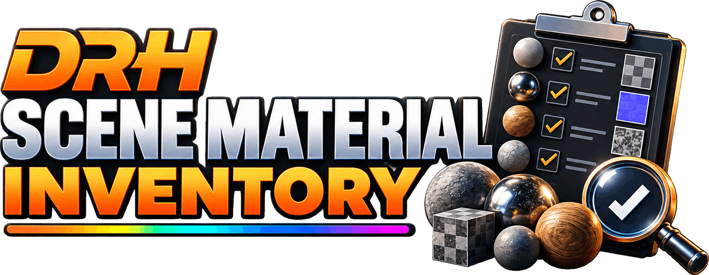

# DRH - Scene Material Inventory

**Audit materials, shader nodes, images, PBR maps, collections, and exportable scene reports**

   

  

---

## Overview

DRH - Scene Material Inventory is a Blender auditing and reporting extension for understanding the material, shader, image, and PBR data actually used by a scene.

Instead of opening materials and node trees one by one, generate a structured inventory for the whole scene and review the result in HTML, XLSX, or CSV. It is designed for scene cleanup, asset handoff, technical review, archviz, product visualization, game/VFX pipelines, and teams receiving Blender files from other artists.

## Key features

| Capability | What it helps you review |
|---|---|
| Scene material inventory | Which materials are present, where they are used, and how many scene objects, datablock users, and material-slot references they have. |
| Shader-node analysis | Reachable node trees, shader types, node counts, nested groups, and Principled BSDF usage. |
| Image audit | Referenced images, source type, resolution/context, packing state, alpha use, file size, and missing-file status where applicable. |
| PBR map review | Common map roles, shader targets, naming fallback, packed-map conventions, alpha use, and color-space review hints. |
| Collection breakdown | Optional per-collection material usage for larger scenes and structured asset reviews. |
| Multi-format reporting | Searchable HTML, structured XLSX workbooks, and CSV exports for portable review and handoff. |
| Privacy-aware output | Path sanitization is enabled by default to reduce exposure of local user-directory information in exported reports. |
| Saved report setup | Save preferred report options as defaults and apply them back to scenes when needed. |

## Product status

| Item | Details |
|---|---|
| Status | **Released** |
| Version | **1.0.0** |
| Blender | 4.2+ |
| Platforms | Windows, macOS, Linux |
| Availability | Free public release |
| Distribution | Official releases are distributed through the linked BlendKit product page |
| Repository role | Documentation, support, issue tracking, compatibility feedback, and product feedback |

## Report formats

- **HTML** - searchable and sortable report with filters, collapsible sections, environment context, optional collection details, and optional PBR-map details.
- **XLSX** - structured workbook with typed numeric cells, frozen headers, native Excel tables, and optional PBR Maps and Collections sheets.
- **CSV** - UTF-8 BOM material inventory with an optional companion `_PBR-Maps.csv` export when PBR details are enabled.

## Review notes

- Unique scene-object use is kept separate from Blender material datablock users and material-slot references.
- Reachable shader node groups are scanned recursively.
- PBR roles use shader connectivity where possible, with names used as a fallback or supplement.
- Color-space results are review hints rather than hard errors because custom shader workflows can intentionally differ.
- UDIM/tiled image handling uses known Blender image tiles when available.
- Alpha use is based on linked Image Texture Alpha outputs.

## Media

Product screenshots:

  
  

## Documentation and support

| Resource | Link |
|---|---|
| Support guide | [SUPPORT.md](SUPPORT.md) |
| User manual | [PDF manual](docs/manual/user-manual.pdf) |
| Repository changelog | [CHANGELOG.md](CHANGELOG.md) |
| Issues | [Open or review issues](https://github.com/pacosalasv/DRH_Scene_Material_Inventory-Support/issues) |
| Discussions | [Ask questions and share feedback](https://github.com/pacosalasv/DRH_Scene_Material_Inventory-Support/discussions) |

## Support development

Support is optional. Ko-fi and PayPal contributions help fund maintenance, Blender compatibility work, documentation, testing, and continued development of free DRH tools.

  
   
  <strong>Prefer PayPal?</strong> <a href="https://www.paypal.com/paypalme/pacosalas?locale.x=en_US&country.x=MX">Support DRH development with PayPal</a>

## Ecosystem

| Destination | Link |
|---|---|
| Download | [Official product page](https://www.blendkit.com/asset-gallery-detail/8225a754-32cd-482d-a0d3-84ea3850fc8f/) |
| Support development | [Ko-fi](https://ko-fi.com/pacosalasv) |
| PayPal | [Support development](https://www.paypal.com/paypalme/pacosalas?locale.x=en_US&country.x=MX) |
| Issues & feedback | [GitHub Issues](https://github.com/pacosalasv/DRH_Scene_Material_Inventory-Support/issues) |
| DRH Add-ons Hub | [Catalog and roadmap](https://github.com/pacosalasv/DRH_Addons_Hub) |
| BlendKit | [DRH Blender catalog](https://www.blendkit.com/?query=author_id:205846) |
| Paco Salas \| DRH | [Official site](https://pacosalasv.blogspot.com/) |
| Xtreme Mindset | [Product lab](https://xtrememindset.blogspot.com/) |
| Sketchfab / Código Píxel | [3D model collections](https://sketchfab.com/codigopixel/collections) |
| KreaOn | [Technology education](https://www.kreaon.com/) |
| PiNu | [Connected physical products](https://pinu.com.mx/) |
| GitHub | [pacosalasv](https://github.com/pacosalasv) |

## License

See [LICENSE](LICENSE) for repository licensing terms.
