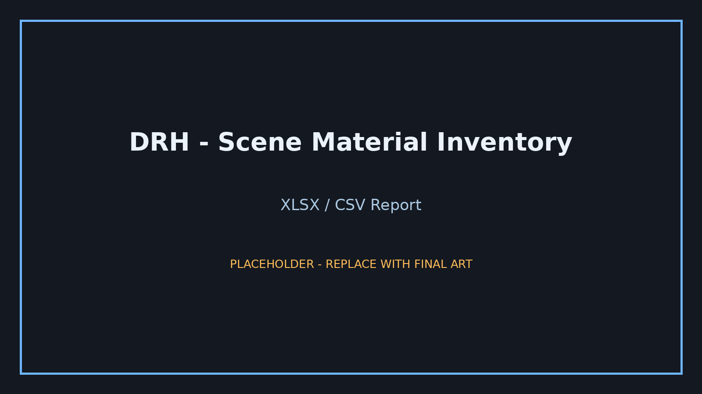

  

 

# DRH - Scene Material Inventory

### Support · Documentation · Feedback · Blender 4.2+

Audit scene materials, shader nodes, referenced images, and PBR maps, then export project reports.

 

DRH Blender Tools: support, documentation, and release information.

---

DRH - Scene Material Inventory is a material-auditing and reporting extension for Blender. It reviews scene materials, shader-node usage, referenced images, and common PBR map roles, then exports the results as HTML, XLSX, or CSV.

This repository contains documentation, support links, issue tracking, compatibility notes, and release information. The installable add-on package is intentionally not hosted in this GitHub repository.

---

## Overview

DRH - Scene Material Inventory helps artists and technical users inspect material usage across a Blender scene without manually opening every material or shader graph.

The extension is designed for material review, look-development cleanup, asset validation, technical art, marketplace preparation, scene handoff, and production reporting.

Location: `3D Viewport > Sidebar > DRH Tools > Material Inventory`

## Media preview

> The product-specific media currently in this repository are labeled placeholders. Replace them with final captures when available.

  

### Screenshots

| Material inventory | PBR map review |
|---|---|
|  |  |

| HTML reporting | XLSX / CSV reporting |
|---|---|
|  |  |

## What it does

The extension scans scene materials and reachable shader-node structures to build a deterministic inventory that can be reviewed directly through exported reports.

It can report:

| Details |
|---|
| unique scene-object material usage |
| Blender material user counts and material-slot references |
| node-based material state and shader types |
| image source details and missing-file checks |
| optional per-collection material breakdown |
| PBR map roles, traced shader targets, naming hints, packing hints, resolution, alpha usage, color-space review hints, and paths |
| environment and report-generation context |

## Capabilities

| Details |
|---|
| Blender 4.2+ Extension package format |
| recursive shader-node and nested node-group scanning |
| Principled BSDF and shader-type reporting |
| source-aware image auditing for generated/viewer, file-backed, packed, tiled/UDIM, movie, and sequence images |
| deterministic material, image, object, and collection ordering |
| connection-aware PBR role tracing with naming fallback |
| recognition of common packed conventions such as ORM, ARM, RMA, and MRA |
| conservative PBR color-space review hints |
| path sanitization enabled by default |
| no third-party Python runtime dependencies |

## Export formats

### HTML

Self-contained DRH-styled report with search, filters, sortable columns, environment information, optional collection details, and an optional PBR Maps section.

### XLSX

Dependency-free Excel workbook with typed numeric cells, frozen headers, native Excel tables, optional PBR Maps sheet, and optional Collections sheet.

### CSV

UTF-8 BOM material inventory. When PBR details are enabled, a sibling `_PBR-Maps.csv` report is generated alongside the main CSV.

## PBR map reporting

When Include image info and Include PBR map breakdown are enabled, the scanner can identify common roles including:

| Details |
|---|
| Base Color / Albedo / Diffuse |
| Ambient Occlusion |
| Metallic / Metalness |
| Roughness / Glossiness |
| Normal |
| Height / Bump / Displacement |
| Alpha / Opacity |
| Emission |
| Specular |
| Transmission |
| Subsurface |
| Coat / Clearcoat |
| Sheen |
| Anisotropy |
| Thin Film |
| Cavity / Mask |

Role detection uses actual shader-node connections when possible and image/node naming as a fallback or supplement. Inferred PBR roles and traced shader targets remain separate so ambiguous workflows stay visible for review.

## Accuracy and privacy

| Details |
|---|
| Unique scene objects are counted separately from material-slot references |
| Reachable shader node groups are recursively scanned |
| UDIM `<UDIM>` and `<UVTILE>` paths use known Blender image tiles where available |
| Alpha use is based on linked Image Texture Alpha outputs |
| `Sanitize paths` is enabled by default and replaces the local home prefix with `%USERPROFILE%` on Windows or `~` on macOS/Linux |
| The operating-system username is not exported |
| Color Space Check results are review hints rather than hard errors because custom shader workflows can intentionally differ |

## Status

| Details |
|---|
| Version: `1.0.0` |
| Status: Released |
| Minimum Blender version: `4.2` |
| Package type: Blender Extension |
| Runtime dependencies: None outside Blender/Python standard functionality used by the extension |

## Support and feedback

Use GitHub Discussions for questions, setup help, workflow guidance, and general suggestions.

Use GitHub Issues for reproducible bugs, regressions, compatibility problems, focused feature requests, or distribution/listing problems.

Please do not post confidential project files, account credentials, private customer data, or other sensitive production information.

## Availability

The installable add-on ZIP is not stored in this GitHub support repository.

DRH add-ons are distributed through the DRH marketplace/profile channels. See the current DRH listings on BlendKit:

- [Paco Salas | DRH on BlendKit](https://www.blendkit.com/?query=author_id:205846)
- [DRH Add-ons Hub](https://github.com/pacosalasv/DRH_Addons_Hub)

## Documentation

- [Support policy](SUPPORT.md)
- [Changelog](CHANGELOG.md)
- [User manual](docs/manual/user-manual.pdf)
- [Manual changelog](docs/manual/manual-changelog.md)

## Support

Use [GitHub Discussions](https://github.com/pacosalasv/DRH_Scene_Material_Inventory-Support/discussions) for setup questions, workflow guidance, and general feedback. Use [GitHub Issues](https://github.com/pacosalasv/DRH_Scene_Material_Inventory-Support/issues/new/choose) for reproducible bugs, regressions, compatibility problems, and focused feature requests.

Do not post credentials, payment information, license keys, confidential production files, private client material, or sensitive local paths.

Detailed guidance is available in [SUPPORT.md](SUPPORT.md).

## Support DRH development

Development support is optional. Contributions through [Ko-fi](https://ko-fi.com/pacosalasv) help cover maintenance, Blender compatibility work, documentation, and testing.

## License

The add-on is licensed under GPL-3.0-or-later. See [LICENSE](LICENSE).

---

Authored by Paco Salas | DRH.
