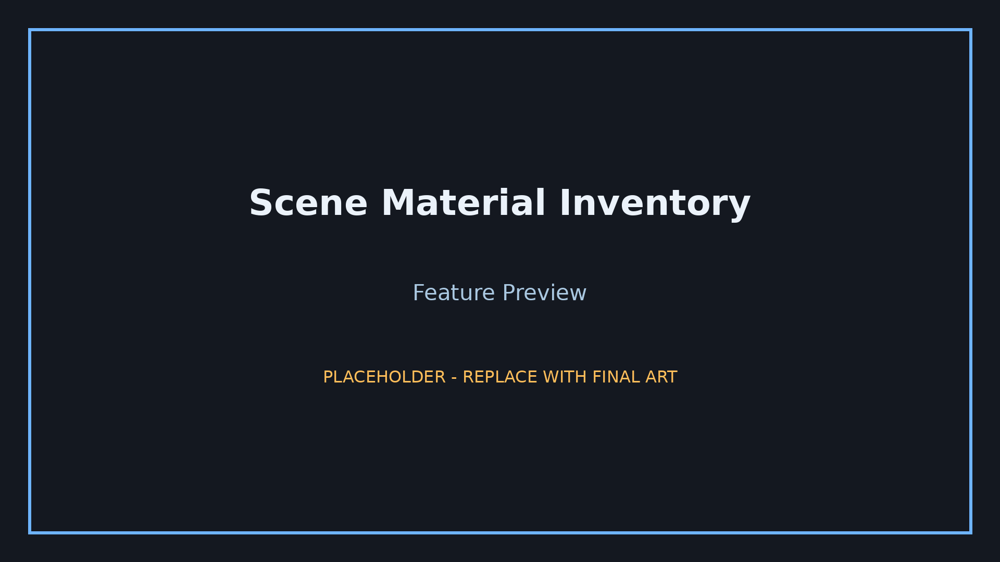
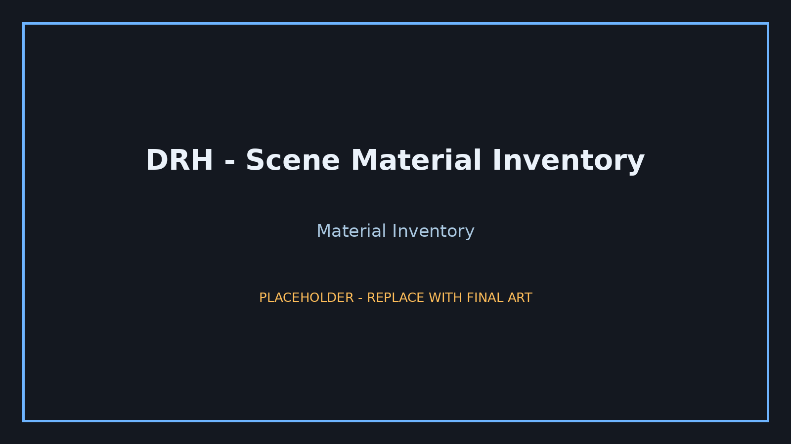
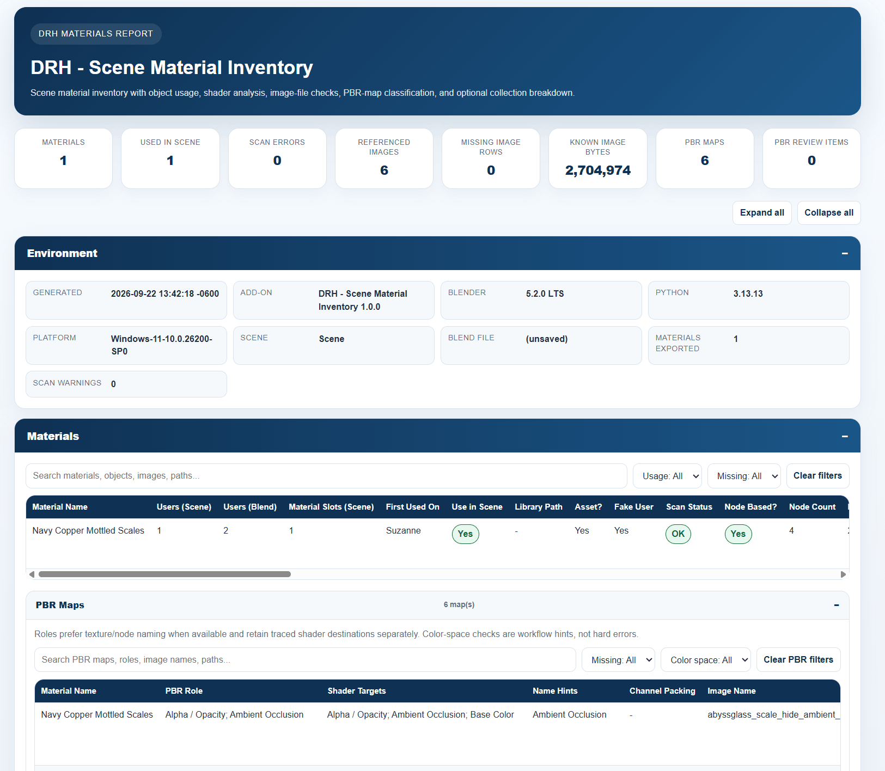

# DRH - Scene Material Inventory

**Audit scene materials, shader nodes, referenced images, PBR maps, and exportable project reports**

   

  

---

## Overview

DRH - Scene Material Inventory is a Blender material-auditing and reporting extension designed to inspect material usage across a scene without manually opening every material or shader graph.

It can inventory materials, reachable shader nodes, referenced images, common PBR map roles, and collection usage, then export review data as HTML, XLSX, or CSV.

## Key features

| Capability |
|---|
| Audit scene materials, shader nodes, referenced images, PBR maps, and exportable project reports |

## Product status

| Item | Details |
|---|---|
| Status | **Under Revision** |
| Version | 1.0.0 Candidate |
| Blender | 4.2+ |
| Platforms | Windows, macOS, Linux |
| Availability | Under revision (not approved yet). No approved public download is linked. |
| Distribution | Review/support repository only until approval. |
| Repository role | Documentation, support, issue tracking, compatibility feedback, and product feedback |

The candidate is documented here for review and feedback; this repository does not host an installable package.

## Media

Product screenshots:

  
  

## Documentation and support

| Resource | Link |
|---|---|
| Support guide | [SUPPORT.md](SUPPORT.md) |
| User manual | [PDF manual](docs/manual/user-manual.pdf) |
| Repository changelog | [CHANGELOG.md](CHANGELOG.md) |
| Issues | [Open or review issues](https://github.com/pacosalasv/DRH_Scene_Material_Inventory-Support/issues) |
| Discussions | [Ask questions and share feedback](https://github.com/pacosalasv/DRH_Scene_Material_Inventory-Support/discussions) |

## Support development

Ko-fi support is optional. Contributions help fund maintenance, Blender compatibility work, documentation, testing, and continued development of free DRH tools.

  

## Ecosystem

| Destination | Link |
|---|---|
| DRH Add-ons Hub | [Catalog and roadmap](https://github.com/pacosalasv/DRH_Addons_Hub) |
| Paco Salas | DRH | [Official site](https://pacosalasv.blogspot.com/) |
| BlendKit | [DRH Blender downloads](https://www.blendkit.com/?query=author_id:205846) |
| Ko-fi | [Support development](https://ko-fi.com/pacosalasv) |

## License

See [LICENSE](LICENSE) for repository licensing terms.
